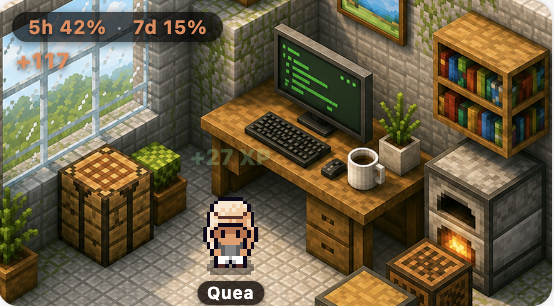
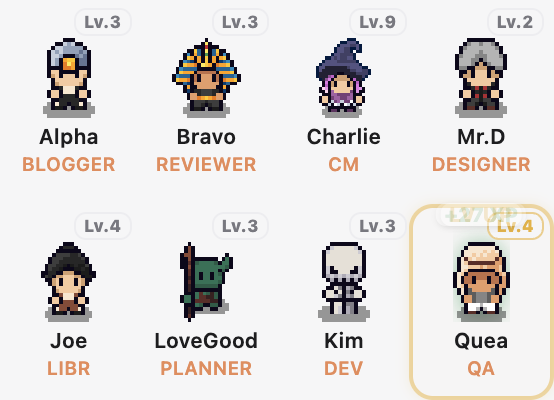

## hwiwoong

혼자서 설계, 구현, 배포까지 합니다. 잘된 것만 전시하지 않습니다.
만드는 과정과 죽인 것까지 [0to1](https://0to1.saegim.studio) 에 남깁니다. · [gnldnd125850@gmail.com](mailto:gnldnd125850@gmail.com)

 

### 이 방에서 일합니다

제 코딩 에이전트들이 일하는 방입니다. 에이전트가 실제로 불려 가면 캐릭터가 걸어 들어와 책상에 앉고, 끝나면 쓴 토큰과 걸린 시간이 남습니다.
막힌 에이전트는 조용히 사라지는 대신 평소보다 오래 앉아 있는 것으로 티가 납니다.

크루 8명. 레벨은 장식이 아니라 실제로 끝낸 일로만 오릅니다. 커뮤니티 매니저 Charlie 가 Lv.9 로 가장 높습니다.

 

  
  
  
  

이 게는 Claude Code 사용량을 읽습니다. 50% 아래에서는 느긋하고, 50% 를 넘으면 일하고, 70% 를 넘으면 무너지고, 한도 근처에서는 기절합니다. 제 게는 대체로 세 번째입니다.

 

### 내놓은 것

**[Claude Usage Crab](https://marketplace.visualstudio.com/items?itemName=saegim.claude-usage-crab)** &nbsp; VS Code 확장 &nbsp;  &nbsp; [source](https://github.com/gnldnd11/claude-usage-monitor)
위의 방과 게가 여기 삽니다. 세션·주간 한도, 컨텍스트, 오늘 쓴 토큰을 상태바와 패널에서 보여 줍니다. 훅 없이 로컬 트랜스크립트만 읽습니다.

**[Harbormaster](https://marketplace.visualstudio.com/items?itemName=saegim.harbormaster)** &nbsp; VS Code 확장 &nbsp; [source](https://github.com/gnldnd11/harbormaster)
떠 있는 로컬 서버를 포트 번호가 아니라 프로젝트 이름으로 보여 줍니다. 에이전트가 켜 놓고 간 dev 서버를 사흘 뒤에 `lsof` 로 찾는 일을 없애려고 만들었습니다.

**[saegim-ai-backend](https://github.com/gnldnd11/saegim-ai-backend)** &nbsp; 프레임워크 없이 만든 AI 에이전트 엔진
같은 인터페이스를 native, LangGraph, ReAct 세 런타임으로 구현하고 토글 하나로 바꿉니다. 함수콜링 12툴, 큐 기반 SSE 스트리밍, 임베딩 RAG, GraphRAG, MCP 호스트를 직접 짰습니다. 프레임워크가 마법이 아니라 도구라는 걸 같은 물건을 세 번 만들어 확인했습니다.

**[saegim-eval](https://github.com/gnldnd11/saegim-eval)** &nbsp; 정답지 없이 LLM 출력을 채점하는 평가 엔진
Claude 출력은 GPT 가, GPT 출력은 Claude 가 채점해 자기 선호를 피합니다. 일부러 심은 환각을 심판이 잡는지로 심판을 검증하고, 회귀가 나면 CI 가 빌드를 깹니다.

 

### 죽인 것도 적습니다

**새김AI** &nbsp; 개인 데이터 위에서 도는 AI 비서를 "개인 데이터 AI OS" 로 키우다 범위가 커져 2026년 4월에 제품으로는 접었습니다. 엔진만 떼어 공개한 것이 위의 저장소 두 개입니다.

 

### 지금

- noon: Apple Watch 앱. App Store 출시를 준비하고 있습니다.
- 파고 있는 것: MCP, Claude Code 로 개발 자동화, LLM 평가의 신뢰성.

 

Python · TypeScript · Java &nbsp;|&nbsp; Next.js · React · FastAPI · Spring Boot &nbsp;|&nbsp; LangGraph · RAG · MCP &nbsp;|&nbsp; Firebase · Docker · Vercel

<picture>
  <source media="(prefers-color-scheme: dark)" srcset="https://raw.githubusercontent.com/gnldnd11/gnldnd11/output/github-contribution-grid-snake-dark.svg" />
  
</picture>

기여 대부분이 비공개 저장소에 있어서 뱀이 먹을 게 별로 없습니다.
