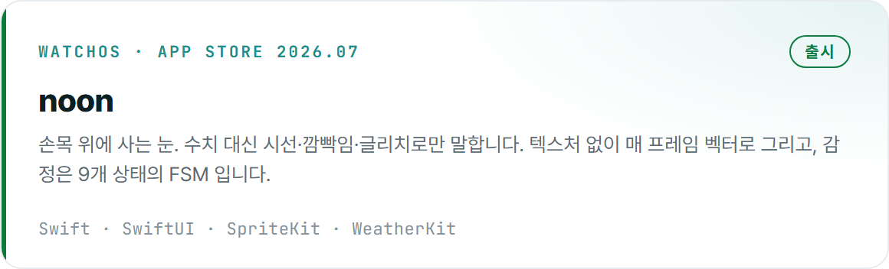
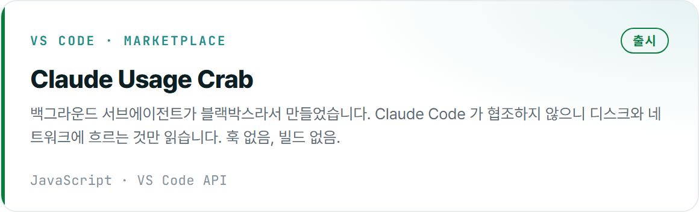
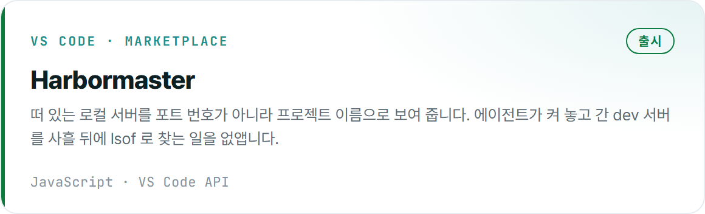
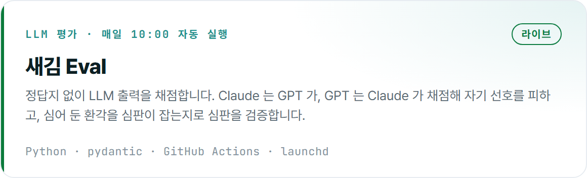
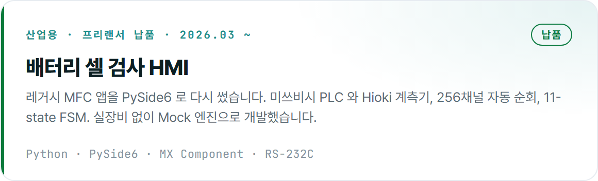
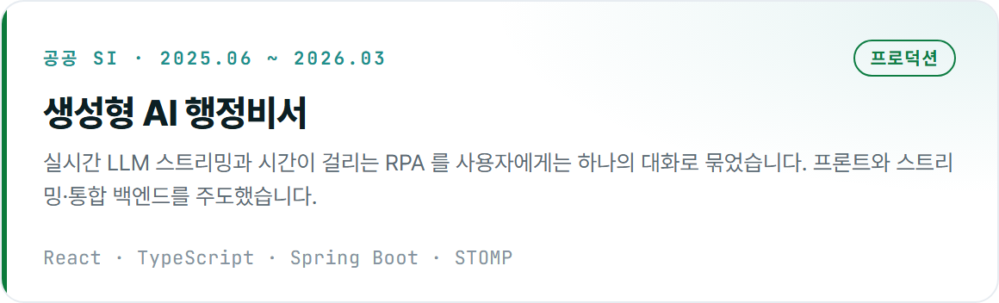
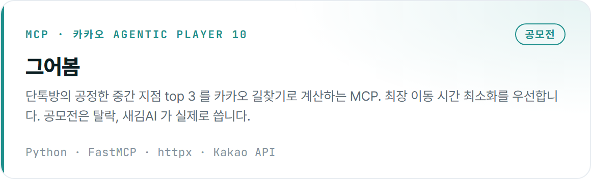
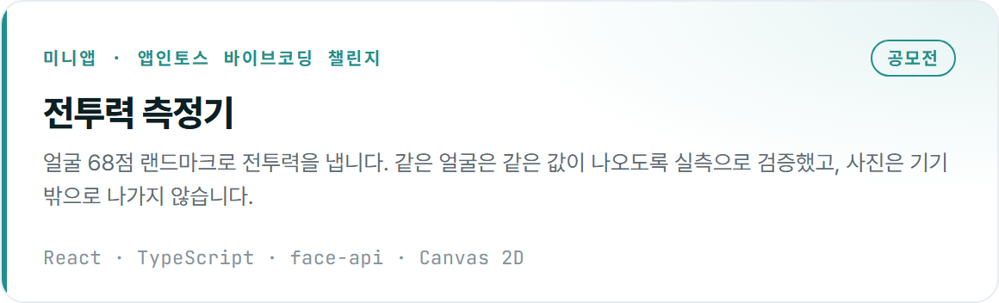
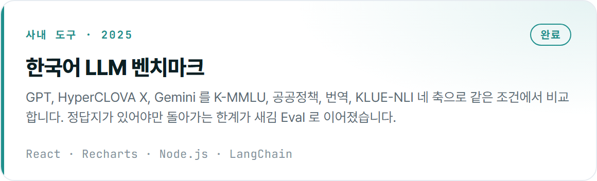
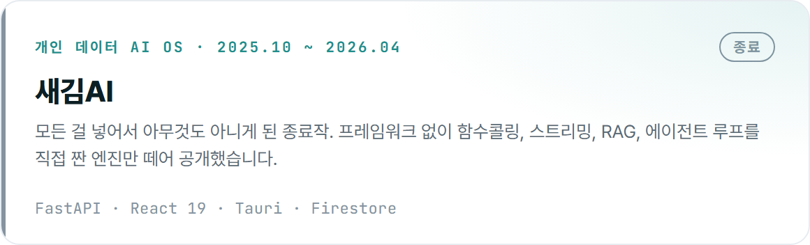

### 김휘웅

혼자서 20개 넘는 프로젝트를 병렬로 굴립니다. 방향은 사람이 정하고, 나머지는 Claude Code 위에 만든 하네스가 돌립니다.
만드는 과정과 죽인 것까지 [0to1](https://0to1.saegim.studio) 에 남깁니다. · [gnldnd125850@gmail.com](mailto:gnldnd125850@gmail.com)

 

  <a href="https://0to1.saegim.studio/projects/noon/"><picture><source media="(prefers-color-scheme: dark)" srcset="assets/cards/noon-dark.png" /></picture></a>
  <a href="https://marketplace.visualstudio.com/items?itemName=saegim.claude-usage-crab"><picture><source media="(prefers-color-scheme: dark)" srcset="assets/cards/claude-usage-crab-dark.png" /></picture></a>

  <a href="https://marketplace.visualstudio.com/items?itemName=saegim.harbormaster"><picture><source media="(prefers-color-scheme: dark)" srcset="assets/cards/harbormaster-dark.png" /></picture></a>
  <a href="https://github.com/gnldnd11/saegim-eval"><picture><source media="(prefers-color-scheme: dark)" srcset="assets/cards/saegim-eval-dark.png" /></picture></a>

  <a href="https://0to1.saegim.studio/projects/cms/"><picture><source media="(prefers-color-scheme: dark)" srcset="assets/cards/cms-dark.png" /></picture></a>
  <a href="https://0to1.saegim.studio/projects/iop-as/"><picture><source media="(prefers-color-scheme: dark)" srcset="assets/cards/iop-as-dark.png" /></picture></a>

  <a href="https://0to1.saegim.studio/projects/geoubom/"><picture><source media="(prefers-color-scheme: dark)" srcset="assets/cards/geoubom-dark.png" /></picture></a>
  <a href="https://0to1.saegim.studio/projects/power-scanner/"><picture><source media="(prefers-color-scheme: dark)" srcset="assets/cards/power-scanner-dark.png" /></picture></a>

  <a href="https://0to1.saegim.studio/projects/ur-bmt/"><picture><source media="(prefers-color-scheme: dark)" srcset="assets/cards/ur-bmt-dark.png" /></picture></a>
  <a href="https://github.com/gnldnd11/saegim-ai-backend"><picture><source media="(prefers-color-scheme: dark)" srcset="assets/cards/saegim-ai-dark.png" /></picture></a>

 

<picture>
  <source media="(prefers-color-scheme: dark)" srcset="https://raw.githubusercontent.com/gnldnd11/gnldnd11/output/github-contribution-grid-snake-dark.svg" />
  
</picture>
