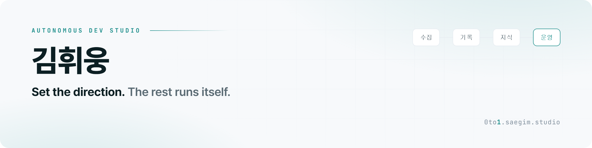
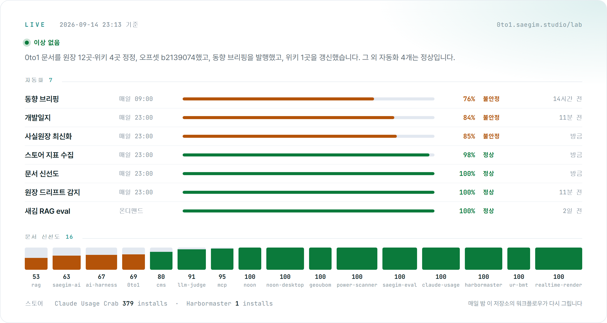

<picture>
  <source media="(prefers-color-scheme: dark)" srcset="assets/header-dark.png" />
  
</picture>

혼자서 20개 넘는 프로젝트를 병렬로 굴립니다. 방향은 사람이 정하고, 나머지는 Claude Code 위에 만든 하네스가 돌립니다.
공공 SI(2022)에서 LLM·RAG 서비스 자체 개발(2025)을 거쳐, 2026년부터는 개인 제품을 만듭니다. 만드는 과정과 죽인 것까지 [0to1](https://0to1.saegim.studio) 에 남깁니다.

 

<a href="https://0to1.saegim.studio/lab/"><picture>
  <source media="(prefers-color-scheme: dark)" srcset="assets/live-dark.png" />
  
</picture></a>

위 현황판은 0to1 의 라이브 페이지를 매일 밤 이 저장소의 워크플로우가 읽어 다시 그린 것입니다. 09시 동향 브리핑, 10시 RAG 평가, 23시 개발일지·신선도·원장 갱신이 사람 없이 돕니다. 성공만 기록하는 자동화는 거짓말을 하므로 종료 코드와 실패 종류를 같이 남깁니다.

 
 

### 하네스

Skills 5개가 모든 대화에 규칙을 자동 주입하고, 역할별 에이전트 7개(구현, 리뷰, 검증, 커밋, 사서, 블로거, 디자이너)가 별도 컨텍스트에서 병렬로 일합니다. 커맨드 8개와 야간 크론 3개가 수집, 기록, 지식, 운영을 잇습니다. 무인 실행은 읽기성 명령만 허용하고 임의 셸은 0개입니다. 세션을 넘는 기억은 파일로 저장소에 커밋합니다. [AI 하네스 문서](https://0to1.saegim.studio/projects/ai-harness/)

 

### 내놓은 것

**[noon](https://0to1.saegim.studio/projects/noon/)** · watchOS · App Store 2026.07
손목 위에 사는 눈. 수치 대신 시선·깜빡임·글리치로만 말합니다. 텍스처 없이 매 프레임 벡터로 그리고, 감정은 9개 상태의 FSM 입니다.

**[Claude Usage Crab](https://marketplace.visualstudio.com/items?itemName=saegim.claude-usage-crab)** · VS Code · Marketplace
백그라운드 서브에이전트가 블랙박스라서 만들었습니다. Claude Code 가 협조하지 않으니 디스크와 네트워크에 흐르는 것만 읽습니다.

**[Harbormaster](https://marketplace.visualstudio.com/items?itemName=saegim.harbormaster)** · VS Code · Marketplace
에이전트가 켜 놓고 간 dev 서버를 프로젝트 이름으로 보여 주고 끕니다.

**[배터리 셀 검사 HMI](https://0to1.saegim.studio/projects/cms/)** · 산업용 · 납품
레거시 MFC 를 PySide6 로 다시 썼습니다. PLC 와 계측기, 256채널 순회, 11-state FSM. 실장비 없이 Mock 엔진으로 개발했습니다.

**[생성형 AI 행정비서](https://0to1.saegim.studio/projects/iop-as/)** · 공공 SI · 프로덕션
실시간 LLM 스트리밍과 느린 RPA 를 하나의 대화로 묶었습니다. 프론트와 스트리밍 백엔드를 주도했습니다.

 

### 실험, 공모전, 소품

[새김 Eval](https://github.com/gnldnd11/saegim-eval) 정답지 없이 LLM 출력을 채점합니다. 교차 채점으로 자기 선호를 피하고, 심어 둔 환각을 심판이 잡는지로 심판을 검증합니다. 매일 10시에 돌아갑니다.
[그어봄](https://0to1.saegim.studio/projects/geoubom/) 단톡방의 공정한 중간 지점을 찾는 MCP. 카카오 AGENTIC PLAYER 10 출품, 탈락.
[전투력 측정기](https://0to1.saegim.studio/projects/power-scanner/) 얼굴 68점 랜드마크로 전투력을 냅니다. 온디바이스. 앱인토스 바이브코딩 챌린지.
[한국어 LLM 벤치마크](https://0to1.saegim.studio/projects/ur-bmt/) GPT, HyperCLOVA X, Gemini 를 4개 축으로 같은 조건에서 비교. 사내 도구.
[noon-desktop](https://0to1.saegim.studio/projects/noon-desktop/) noon 의 눈에 Claude 와 로컬 음성 인식을 붙인 macOS 프로토타입.
[txtfy](https://0to1.saegim.studio/projects/txtfy/) · [transparentfy](https://0to1.saegim.studio/projects/transparentfy/) · [나라런](https://0to1.saegim.studio/projects/nararun/) 빌드 없는 단일 HTML 소품과 생일 선물 게임.

 

### 접은 것

[새김AI](https://github.com/gnldnd11/saegim-ai-backend) 2025.10 ~ 2026.04. 개인 데이터 AI OS 를 지향하다 24개 앱을 한 UI 에 뭉쳤고, 프론트 코드의 42% 가 진입로 없는 죽은 코드였습니다. "모든 걸 넣어서 아무것도 아니게 된" 종료작. 프레임워크 없이 함수콜링, 스트리밍, RAG, 에이전트 루프를 직접 짠 엔진만 떼어 공개했습니다. 실패한 제품이지만 성공한 학교였습니다.

 

Python · TypeScript · Swift · Java &nbsp;|&nbsp; Next.js · React · FastAPI · Spring Boot · SwiftUI · PySide6 &nbsp;|&nbsp; Claude · LangGraph · RAG · MCP &nbsp;|&nbsp; Firebase · Vercel · Docker · launchd &nbsp;|&nbsp; [gnldnd125850@gmail.com](mailto:gnldnd125850@gmail.com)
